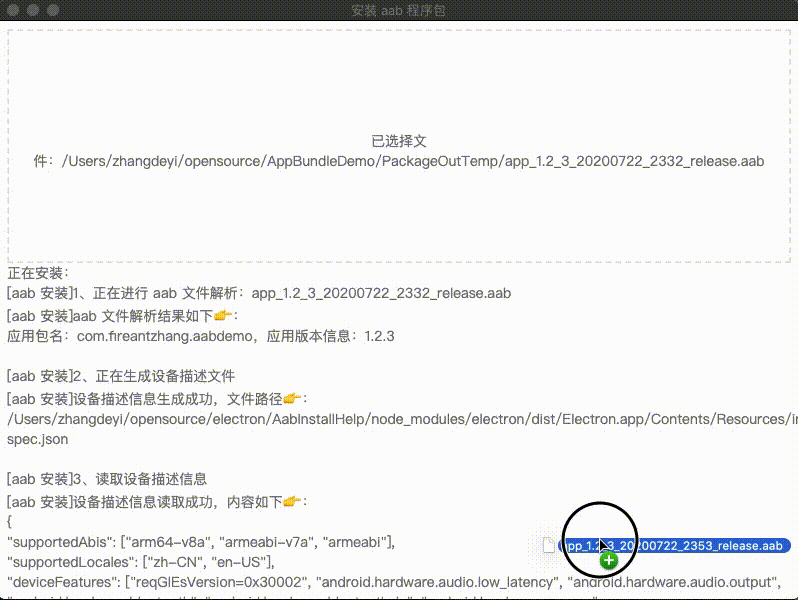

# AabInstallHelp

### 用途：

该项目主要是一个简单的安卓平台的 `aab` 安装包辅助安装软件，软件内置了 `bundletool` 工具和 `adb` 程序包，可以直接简单的选择一个目标安装包，即可自动完成安装流程，主要为了方便非研发人员安装 `aab` 格式的安装包。

大致的安装示意情况如下：




项目是使用 [Electron](https://www.electronjs.org/) 进行开发（特点是：使用 js，html 和 css 构建跨平台的桌面应用），目前该工具支持输出 mac 和 window 平台的安装包。

### 构建流程
1. 确认本地有 node 和 npm 环境，如果没有需要先配置：[配置方式](https://nodejs.org/en/download/)

```
~ » node -v
v13.4.0

~ » npm -v
6.14.4
```

2. 如果本地已有 node 和 npm 环境，代码 clone 到本地之后，进入到项目根目录，执行以下命令即可运行

```
// 1、初始化项目
~ » npm install

// 2、mac 平台运行方式
~ » npm run start 

// 3、window 平台运行方式
~ » npm run start_win

// 初次构建，两个命令也可以一起运行，比如 mac
~ » npm install && npm run start
```

### 打包方式（会在根目录的 `release` 文件夹下）
1. mac 平台
```
npm run elebuild_mac
```

2. window 平台
```
npm run elebuild_win
```

### 签名说明

所有 aab 安装时都会使用内置的 Android debug 测试签名（`assets_common/debug.keystore`），不再读取或内置任何正式签名。

因此本工具只适合本地/测试安装，不能用于覆盖已用正式签名安装的包，也不适合作为上架签名。启动 Activity 会从 aab 清单中解析。

